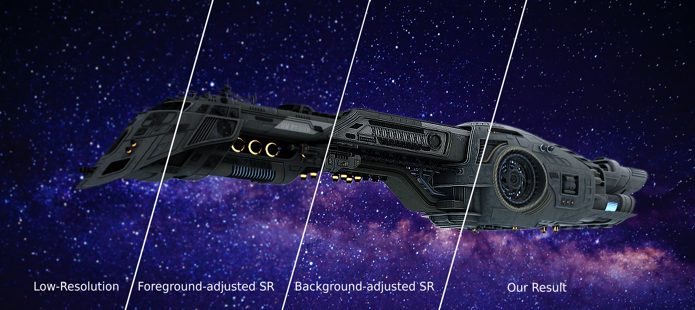

# BlindSR

## Blind Image Super-Resolution with Spatially Variant Degradations
### Publication: [ACM Siggraph Asia 2019](https://sa2019.siggraph.org/)

#### Authors: [Victor Cornillère](https://github.com/sunreef), [Abdelaziz Djelouah](https://adjelouah.github.io/), [Wang Yifan](http://yifita.github.io/), [Olga Sorkine-Hornung](http://igl.ethz.ch/people/sorkine/), [Christopher Schroers](https://la.disneyresearch.com/people/christopher-schroers/)



Independent implementation of the algorithm from the paper "Blind Image Super-Resolution with Spatially Variant Degradations"

[[Project page]](https://igl.ethz.ch/projects/variational-blind-sr/) [[Paper]](https://igl.ethz.ch/projects/variational-blind-sr/variant-blind-sr.pdf)


## Requirements

This project runs with Python 3.7.3 (recommended to use Anaconda) with the following dependencies:
- torch
- torchvision
- Pillow
- imageio
- tensorboardX

## Usage

### Testing

To test our algorithm on your images, run the following from the root folder of the project:

```
python src/main.py --mode test --input /path/to/your/image/folder --output /path/to/output/folder
```

This will apply our x2 upscaling algorithm on each image contained in the input folder.
The output folder will contain the upscaling results along with a picture of the estimated kernel we recovered for each image.

You can leave the `--input` and `--output` arguments empty and they will default to `input` and `output` folders contained in the root of the project.

If your test crashes due to insufficient GPU memory, you can adjust the size of the patches we use for processing by adding a `--patch_size` argument.
The default size is 200. Lower it if you encounter memory issues.


### Training

If you want to retrain our models on your own dataset, you can do so as well.

Our training process has two phases. You first have to train the generator network:

```
python src/main.py --mode train --network_type generator --train_input path/to/training/data --valid_input path/to/validation/data
```

Tensorboard logs will be generated in the `logs/x2_blind_sr` folder and checkpoints saved in the `checkpoints/x2_blind_sr` folder.

Once your generator has finished training, you can launch the training of the discriminator:

```
python src/main.py --mode train --network_type discriminator --train_input path/to/training/data --valid_input path/to/validation/data
```

Make sure that the checkpoint of the generator `checkpoints/x2_blind_sr/generator.pth` exists when you start training the discriminator.
The logs and checkpoints of the discriminator training will be saved in the same place.

## Remarks

This repository is an independent re-implementation of the algorithm from the paper "Blind Image Super-Resolution with Spatially Variant Degradations", published at Siggraph Asia 2019.

**This is not the original code used to generate the results presented in the paper.**

Results might be different due to slight differences in architecture, training strategies or datasets.


## Publication

If this code helps your research, please consider citing the following paper.

**Blind Image Super-Resolution with Spatially Variant Degradations** - <i>[Victor Cornillère](https://github.com/sunreef), [Abdelaziz Djelouah](https://adjelouah.github.io/), [Wang Yifan](http://yifita.github.io/), [Olga Sorkine-Hornung](http://igl.ethz.ch/people/sorkine/), [Christopher Schroers](https://la.disneyresearch.com/people/christopher-schroers/)</i> - Siggraph Asia 2019.

```
@article{CDW19blindsr,
    author = {
        Cornill{\`e}re, Victor and
        Djelouah, Abdelaziz and
        Yifan, Wang and
        Sorkine-Hornung, Olga and
        Schroers, Christopher},
    title = {Blind image super resolution with spatially variant degradations},
    journal = {ACM Transactions on Graphics (proceedings of ACM SIGGRAPH ASIA)},
    volume = {38},
    number = {6},
    year = {2019},
}
```

## Contacts
If you have any question, please contact [Victor Cornillère](mailto:covictor@inf.ethz.ch).

